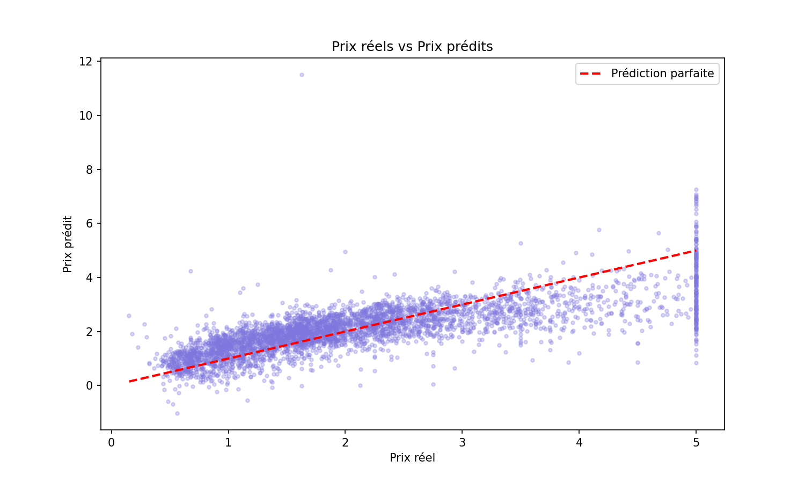
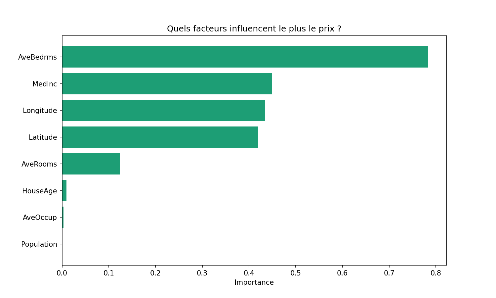

# 🏠 Prédiction du Prix des Maisons

Prédiction du prix des maisons en Californie avec un modèle de Machine Learning.

## Objectif
Prédire le prix d'une maison à partir de caractéristiques
comme le revenu du quartier, l'âge de la maison, 
le nombre de pièces...

## Résultats
- 20 640 maisons analysées
- Erreur moyenne du modèle : 74 558$
- Le revenu du quartier est le facteur le plus influent

## Technologies
Python · Scikit-learn · Pandas · Matplotlib

## Visualisations

